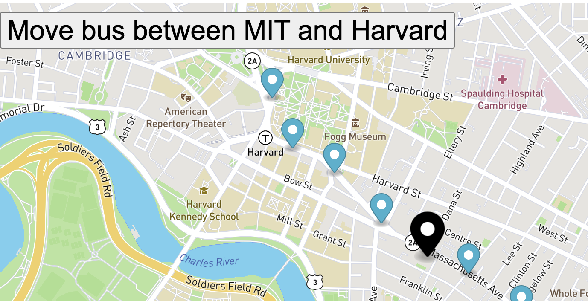

# realTimeBusTrackerModule9
Real Time Bus Tracker exercise from Module 9

# Project Description: 
This project offers two features: 
- Shows the stops of the bus 
  - This map shows all the stops of the bus route between MIT and Harvard
  - The size of the marker is default but the color has been changed to blue color
- Move Bus  
  - There is another marker with black color but increased size placed at the starting stop - which is MIT. 
  - The button "Move bus between MIT and Harvard" is available at the top left of the page. 
  - When user clicks this button, the black marker will move across all the stops between MIT and Harvard.  

# How to run the project:
1. Download the files, 
2. Open the index.html in a browser window to execute this project. 
3. There is a button on top left of the page, and the information about this is provided in project description above. Use the buttons to execute the code. 

# Image
 

# Future Improvements:
- The 'Move bus between MIT and Harvard' button - if this button is pressed multiple times when game is already in motion, it increases the speed of the bus move (the black marker moves faster)
- This can be enhanced further 
- Couple of ideas: 
  - Have a stop and pause button - this would provide an option to stop or pause the bus. 
  - When 'Move bus' button is clicked once and the stop is already moving, do not initiate the logic again. Add the logic to implement this functionality.
  - Disable the 'Move bus' button once game is in progress, so that the process is visible to the user that button is disabled due to game in progress . 
  

# License Information: 
MIT License

Copyright (c) 2022

Permission is hereby granted, free of charge, to any person obtaining a copy
of this software and associated documentation files (the "Software"), to deal
in the Software without restriction, including without limitation the rights
to use, copy, modify, merge, publish, distribute, sublicense, and/or sell
copies of the Software, and to permit persons to whom the Software is
furnished to do so, subject to the following conditions:

The above copyright notice and this permission notice shall be included in all
copies or substantial portions of the Software.

THE SOFTWARE IS PROVIDED "AS IS", WITHOUT WARRANTY OF ANY KIND, EXPRESS OR
IMPLIED, INCLUDING BUT NOT LIMITED TO THE WARRANTIES OF MERCHANTABILITY,
FITNESS FOR A PARTICULAR PURPOSE AND NONINFRINGEMENT. IN NO EVENT SHALL THE
AUTHORS OR COPYRIGHT HOLDERS BE LIABLE FOR ANY CLAIM, DAMAGES OR OTHER
LIABILITY, WHETHER IN AN ACTION OF CONTRACT, TORT OR OTHERWISE, ARISING FROM,
OUT OF OR IN CONNECTION WITH THE SOFTWARE OR THE USE OR OTHER DEALINGS IN THE
SOFTWARE.
